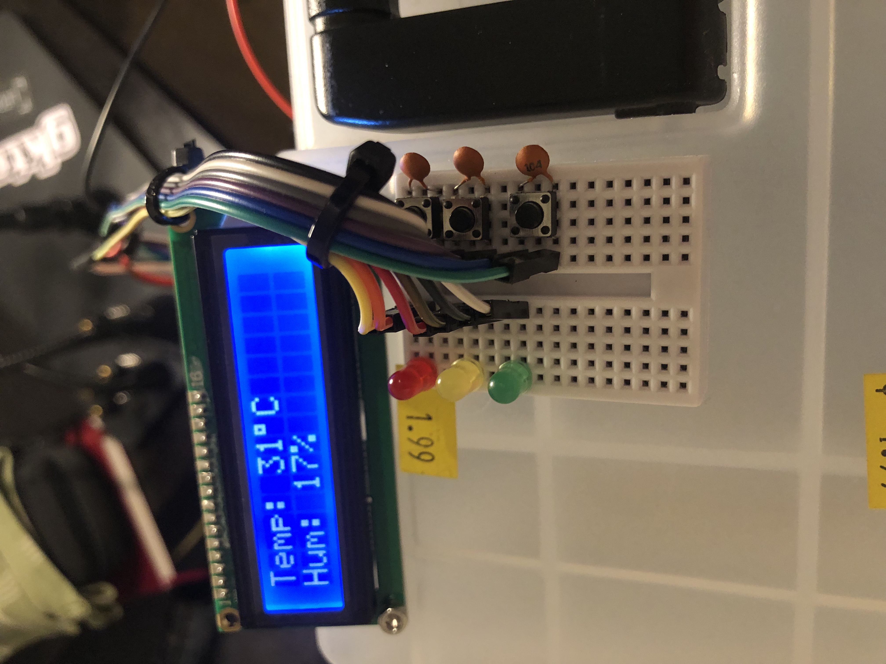

# Group 88's Final Project for CPE 301

This repository contains the code and all the reference materials that were used for assistance in the final project.

## Description

The final project is a physical swamp cooler. The swamp container contains these parts:

1. 3 Buttons (1 for start, stop, reset. 2 for stepper motor control)
2. Relays for Fan and Pump (2 SRD05VDC-SC-C)
3. Stepper Motor
4. LCD (LiquidCrystal Display)
5. Analog Water Sensor
6. DS1307 (External Clock)
7. DHT11 (Temperature Sensor)
8. ATMega2560
9. 12V 40CFM DC Blowerfan
10. Peristaltic Motor

## Circuit Details

3 Buttons (1 for start, stop, reset. 2 for stepper motor)

 
One button is used to control the entire circuit. It can start, stop, and reset.

The bottom button is used to control all of the states that it can (DISABLED, IDLE). The upper two buttons are stepper motor controls to turn either clockwise or counterclockwise.

Relays for Fan and Pump (2 SRD05VDC-SC-C)

 
We used relays to help simplify the control of fans and pumps. They are the red rectangles.

Stepper Motor

 
Stepper motor is used to adjust vent. It is to the left of the picture.

LCD (LiquidCrystal Display)

 
LCD is used to help display useful information. It is the big display.

Analog Water Sensor

 
It is used to measure how much water is inside the swamp cooler. It is on the bottom of the picture.

DS1307 (External Clock)

 
It is used to print accurate timestamps. It is in the middle of the white breadboard.

DS1307 (External Clock/RTC)

 
It is used to print accurate timestamps. It is in the middle of the white breadboard.

DHT11 (Temperature Sensor)

 
It is used to measure temperature and humidity. It is above the RTC.

ATMega2560

 
It is used to control the whole circuit. It is underneath the breadboard.

12V 40CFM DC Blowerfan

 
It is used to take in heat and dump it outside. It is the black thing with a rectangular shape.

Peristaltic Motor

 
It is used to pump water to the cooler pad. It can be found underneat the Blowerfan.

## Schematic Diagram

The diagram in question

 

## System Demonstration

Clicking upon this will redirect you to this link: https://www.youtube.com/watch?v=Vm3F59e2kbA

## Team Members
The team consists of the burnt out students: Aaron Ba, William Toohey, Sean Lai

All credit of the physical circuitry goes to William Toohey, along with some of the code. Aaron Ba and Sean Lai revamped the code.

## Extra Stuff

Check out the "extras" folder as it has many more photos of the circuit, and the physical build. It also includes the final report and the wiring diagram. 